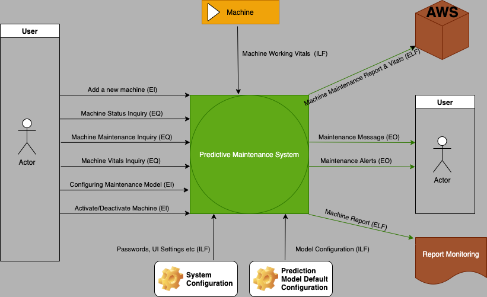

## Predictive Maintenance Functional Points Analysis

### Introduction

It is the method or set of rules to measure the amount of software functionalities and software size of the software developed product. It depends on the logical flow of the application i.e. the number of functionalities deliver to the user.

The various parameters involved in the functional point analysis are:
  - External Inputs
  - External Outputs
  - External Inquiries
  - Internal Logical Files
  - External Logical Files

External Inputs, External Outputs & External Inquiries belong to the "Transactional Functional Type", where as Internal Logical Files & External Logical Files belong to the "Data Functional Type".

### Project Functional Point Analysis

In the predictive maintenance project logical flows and user functionalities that are intended to be delivered are shown in the image below.

The computational process of the functional point analysis will be detailed out in end of the document.

The detail description of the image as per the functional point analysis:

1. **External Inputs (EI)**: There are basically 3 external inputs in the software. The user is allowed to do "Add a new machine", "Configure the prediction model" & "Activate & Deactivate machine". The "Configure the prediction model" will be computed with high weight factor (6) and rest will be computed with average weight factor (4).

2. **External Outputs (EO)**: There are basically 2 external outputs in the software. "Maintenance Messages" and "Maintenance Alerts (finding next maintenance prediction)". Both these outputs are crucial for the organization to run their business smoothly. So these outputs will be computed with high weight factor (7).

3. **External Inquiries(EQ)**: There are 3 external inquiries present in the software. The user is allowed to inquire "Machine Vitals over time period", "Machine Status Inquiry" & "Machine Maintenance Inquiry". Out these "Machine Maintenance Inquiry" will be computed with high weight factor (6) and rest will be computed with average weight factor (4).

4. **Internal Logic Files(ILF)**: In the current software there are 3 internal logical files, "System Configuration", "Prediction Model Default Configuration" & "Machine Working Vitals". The machine working vitals can be either input to software directly or indirectly by placing them in a previously defined directory. In the software we assume that machine vitals will be dumped by the machine at the predefined location. "Machine Working Vitals" will be computed with high weight factor (15) and remaining will be computed with average weight factor (10).

5. **External Logic Files(ELF)**: In the current software there are 2 external logical files, "Machine Report" & "Machine Report & Vitals". Both these can be shared with external softwares or can be stored in external databases. Both these will be computed with the average weight factor (7).

### Project Functional Point Computation:

**Functional Point Formula (FP)** =  TC * CAF
**Total Cost Factor (TC)** = Weight * Count of Functional Point Parameters
**Complexity Adjustment Factor (CAF)** = 0.65 + (0.01 * Sum of Value adjustment factor based on 14 questions)

###### Computing Total Cost Factor

| Parameter | Count | Weight | Total |
| ----------- | ----------- | ----------- | ----------- |
| External Inputs | 3 | (6 * 1) + (4 * 2)   | 14 |
| External Outputs | 2 |(7 * 2)| 14 |
| External Inquiries | 3 |(6 * 1) + (4 * 2)| 14 |
| Internal Logical Files | 3 |(15 * 1) + (10 * 2)| 35 |
| External Logical Files | 2 |(7 * 2)| 14 |

**Total Cost Factor** = 14 + 14 + 14 + 35 + 14 = **91**

###### Computing Complexity Adjustment Factor

| Question | Scale | Weight |
| ----------- | ----------- | ----------- |
| Data Communication  | Moderate | 2 |
| Distribute Data Processing | Average | 3 |
| Performance | Average | 3 |
| Heavily Used Configuration | Moderate| 2 |
| Transactional Role  |Moderate | 2 |
| Online Data Entry  | No Influence | 0 |
| End User Efficiency  | Significant | 4 |
| Online Update | Incidental | 1 |
| Complex Processing | Moderate | 2 |
| Reusability | Moderate | 2 |
| Installation Ease | Average | 3 |
| Operational Ease | Average | 3 |
| Multiple Sites | Moderate| 2 |
| Facilitate Changes | Moderate | 2 |
| **Total** | | **31** |

**Complexity Adjustment Factor (CAF)** = 0.65 + (0.01 * 31) = **0.96**

###### Computing Functional Point

**Functional Point Formula (FP)** =  91 * 0.96 = **87.36**

Based on the FP measure of software many other metrics can be computed:
- Errors/FP
- $/FP
- Defects/FP
- Pages of Documentation/FP
- Errors/FP
- Productivity = FP/PM (effort is measured in person-months)
- $/Pages of Documentation

#### Appendix

The functional point analysis parameters and weights factors table

| Parameter | Low | Average | High |
| ----------- | ----------- | ----------- | ----------- |
| External Inputs | 3 | 4 | 6 |
| External Outputs | 4 | 5 | 7 |
| External Inquiries | 3  | 4 | 6 |
| Internal Logical Files | 7 | 10 | 15 |
| External Logical Files | 5  | 7 | 10 |

The Complexity Adjustment Factor Scale

| Scale | Weight |
| ----------- | ----------- |
|No Influence| 0 |
|Incidental| 1 |
|Moderate| 2 |
|Average| 3 |
|Significant| 4 |
|Essential| 5 |
