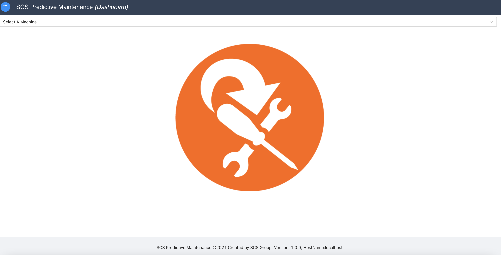

## Deployment Guide

Deployment guide document is installation and start up guide for predictive maintenance system.

#### Packages Installation

- Prepare the deployment machine with the following stack:
  - Install [Google Chrome](https://www.google.com/chrome/) from the official website
  - Install Nodejs and npm on the machine from [Nodejs](https://nodejs.org/en/download/) official website
  - One can verify node installation on the deployment machine by running the following command in the terminal
    ```
      node -v
      This will give version installed on the machine e.g.: v16.11.1
    ```
  - One can verify npm (Node package manager) installation on the deployment machine by running the following command in the terminal
    ```
      npm -v
      This will give version installed on the machine e.g.: 8.0.0
    ```
  - Install Python3 on the machine from [Python](https://www.python.org/downloads/) official website or using the brew. Use the following command to install python3 using brew
    ```
      brew install python@3.9
    ```
  - One can verify the python3 installation on the machine by running the following command in the terminal
    ```
      python3 --version
      This will give version installed on the machine e.g.: Python 3.9.10
    ```
  - Install flask and scikit-learn packages on the deployment machine
    ````
      pip install Flask
      pip install -U scikit-learn
    ````
  - All the desired packages are installed on the machine

#### Clone the source code from github:

- This document assumes that GIT is already installed on the deployment machine.
- Clone the source code from [Github](https://github.com/amittkSharma/scs_predictive_maintenance) and using the following command in the terminal
  ```
    git clone https://github.com/amittkSharma/scs_predictive_maintenance.git
  ```
- Note: If the repository is unreachable please contact the owner, in order to get the access.

#### System Build & Start Up

- In the first phase of the project, docker deployment is not implemented so we need to build the whole project on the deployment machine and then start it up.
- Follow the steps to build and start the system on the deployment machine:
  1. Open the command terminal, navigate to the source of the code just cloned in the above step. Execute the following command
    ````
      npm install
      This will install all the desired packages only with in the scope of project and not globally
    ````
  2. Once all the packages are installed, now it's time to build the whole system, running the following command
    ````
      npm run build
    ````
  3. Navigate to the server folder (scs-pm-server) present inside the packages folder. The path of the server folder is "/source/packages/scs-pm-server", and <b>start the server</b> using the following command
    ````
      npm start
    ````
  4. Navigate to the client folder (scs-pm-client) present inside the packages folder. The path of the server folder is "/source/packages/scs-pm-client", and <b>start the client</b> using the following command
    ````
      npm start
    ````
  5. The web application will open in the chrome browser. The address bar in chrome will be "http://localhost:3000/danceeditor/keyvalues"

#### Conclusion

The system is up and running on the machine.



If there is some problem in the deployment, please contact the deployment team.
